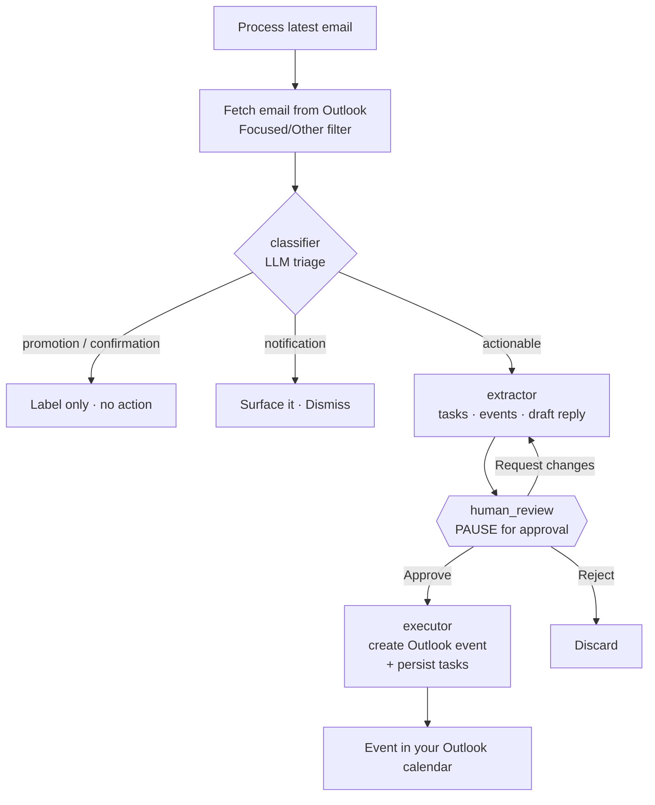
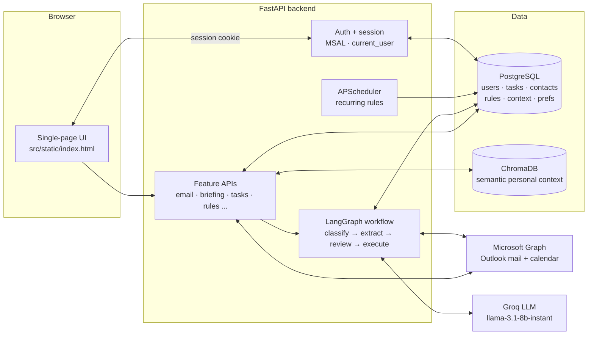

# Cadence

Cadence reads your inbox, decides which emails actually need action, and turns them into calendar events and tasks — **always with your approval**. It also writes draft replies, builds your daily schedule, prepares you for your next meeting, and remembers context about the people and rules in your life.

It runs as a multi-user web app: each person signs in with their own Microsoft (Outlook) account and only ever sees their own data.

> **Two branches, two email providers** — see [Branches](#-branches) below.
> - **`main`** → Microsoft 365 / **Outlook** (Microsoft Graph). The current, deploy-ready, multi-tenant app at https://cadence-tf1v.onrender.com/.
> - **`google-version`** → the original **Gmail + Google Calendar** prototype (single user).

---

## Branches

| Branch | Email + Calendar | Auth | Status |
|--------|------------------|------|--------|
| **`main`** | Microsoft **Outlook** mail + calendar via **Microsoft Graph** | **MSAL** (Microsoft sign-in), session cookies, encrypted tokens | Multi-tenant, security-hardened, Render-deployable |
| **`google-version`** | **Gmail** + **Google Calendar** via the Google APIs | Google OAuth | Original single-user prototype (frozen) |

Both branches share the **same architecture, the same AI workflow, and the same 7 features** — only the provider integration and the login differ. The services were deliberately given matching interfaces (`get_email_content`, `get_unread_emails`, `send_email`, `get_upcoming_events`, `create_event`), so the LangGraph workflow and the API layer are provider-agnostic.

Why Microsoft for the public version? Google's Gmail API requires an expensive annual security assessment (CASA) to serve restricted scopes publicly; Microsoft's bar for mail scopes is much lighter.

---

## Features

The web UI is a single page with seven tabs:

1. **Email → Calendar** — Process your latest email: the AI classifies it, extracts any tasks and proposed calendar events, and pauses for your **Approve / Reject / Request-changes** decision before anything is created. Can also draft a reply.
2. **Morning Briefing** — Categorizes your unread mail (urgent / action / FYI / newsletter / promo) and summarizes today's calendar.
3. **Meeting Prep** — A briefing for your next meeting, with context pulled from recent emails with the attendees.
4. **Tasks** — AI-extracted tasks, sorted by urgency, with due dates, overdue flags, and one-click complete.
5. **Contacts** — AI-maintained memory of the people you communicate with, updated after each email.
6. **My Rules** — Save personal context ("CS101 every Mon/Wed 9–11am"), create recurring reminders, and choose which inbox sections to track (**Focused / Other**).
7. **Daily Schedule** — An AI-built plan for your day from your calendar events, open tasks, personal rules, and recurring reminders.

---

## How the email → calendar workflow works

The core feature is a **human-in-the-loop LangGraph agent**. When you process an email, it runs a classify → extract → review → execute pipeline that **pauses for your approval** before touching your calendar:



- **classifier** — one cheap LLM call buckets the email so promotions and notifications don't generate junk tasks.
- **extractor** — only runs for genuinely actionable mail; produces tasks/events (only when there's a clear task **and** date) and an optional suggested reply.
- **human_review** — the graph *pauses* here using LangGraph's `interrupt()`, persisting its state keyed by a `thread_id`. Your decision resumes it.
- **executor** — runs **only after approval**: creates the Outlook calendar event(s) and saves the task(s). Nothing is created without your say-so.

---

## Architecture



**Highlights**
- **Auth & isolation** — Microsoft sign-in (MSAL), a signed-cookie session, and a `current_user` dependency on every endpoint. Each user only ever touches their own rows.
- **Token security** — each user's Outlook refresh token (`ms_token_cache`) is **encrypted at rest** with Fernet (`TOKEN_ENCRYPTION_KEY`). Session cookies are `Secure` in production.
- **AI** — Groq's `llama-3.1-8b-instant` with structured (JSON) output for classification, extraction, briefing, meeting prep, and schedule generation.
- **Semantic memory** — personal rules/preferences live in **ChromaDB** for relevance search and are rebuilt from PostgreSQL (the source of truth) on startup.
- **Scheduler** — APScheduler fires recurring rules to auto-create tasks (gated by `RUN_SCHEDULER`).

---

## Tech stack

- **Backend:** Python 3.12, FastAPI / Starlette, Uvicorn
- **AI / agent:** LangGraph (human-in-the-loop), LangChain, Groq (`llama-3.1-8b-instant`)
- **Data:** PostgreSQL (async SQLAlchemy + asyncpg), ChromaDB (vector store)
- **Auth:** MSAL (Microsoft) on `main` / Google OAuth on `google-version`, Starlette session cookies, Fernet token encryption
- **Scheduling:** APScheduler
- **Deploy:** Docker + Render (`Dockerfile`, `render.yaml`)

---

## Project structure (`main`)

```
.
├── src/
│   ├── api/                    # FastAPI routers
│   │   ├── auth.py             # Microsoft (MSAL) login / callback / logout / me
│   │   ├── deps.py             # current_user session dependency
│   │   ├── test.py             # "Process latest email" trigger
│   │   ├── approval.py         # pending plan, approve/reject, send draft
│   │   ├── briefing.py         # morning briefing
│   │   ├── meeting_prep.py     # meeting prep
│   │   ├── tasks.py            # task list / contacts
│   │   ├── context.py          # personal context + recurring rules
│   │   ├── daily_schedule.py   # AI daily schedule
│   │   └── settings.py         # email sections (Focused/Other)
│   ├── services/
│   │   ├── ms_auth.py          # MSAL token provider (silent refresh)
│   │   ├── outlook_mail_service.py      # Graph mail (read/send/search)
│   │   ├── outlook_calendar_service.py  # Graph calendar (events)
│   │   ├── crypto.py           # Fernet encrypt/decrypt for tokens
│   │   ├── text_utils.py       # HTML → text for email bodies
│   │   ├── contact_service.py  # AI contact memory
│   │   ├── scheduler_service.py# APScheduler recurring rules
│   │   └── user_context_service.py # ChromaDB personal context
│   ├── workflows/
│   │   ├── agent.py            # LangGraph nodes + graph
│   │   ├── trigger.py          # starts the workflow for an email
│   │   └── state.py            # agent state + Pydantic schemas
│   ├── models/                 # SQLAlchemy models (user, task, contact, ...)
│   ├── static/index.html       # the web UI
│   ├── config.py               # settings (env-driven)
│   └── main.py                 # FastAPI app + lifespan
├── Dockerfile
├── render.yaml                 # Render blueprint (web + Postgres)
└── requirements.txt
```

On `google-version`, `services/` instead contains `google_auth.py`, `gmail_service.py`, and `calendar_service.py`.

---

## Running locally

**Prerequisites:** Python 3.12, a PostgreSQL database, a [Groq API key](https://console.groq.com), and — for `main` — a Microsoft **Entra app registration** (for `google-version`, a Google Cloud OAuth client).

```bash
git clone <repo-url>
cd ai-task-scheduler
python -m venv venv
# Windows: venv\Scripts\activate   |   macOS/Linux: source venv/bin/activate
pip install -r requirements.txt
```

Create a `.env` (see [Configuration](#%EF%B8%8F-configuration)), then run:

```bash
python -m uvicorn src.main:app --reload
```

Open http://localhost:8000 and **Sign in with Microsoft**.

### Microsoft Entra app registration (`main`)
1. [entra.microsoft.com](https://entra.microsoft.com) → **App registrations → New registration**.
2. Supported account types: **Accounts in any organizational directory and personal Microsoft accounts**.
3. Redirect URI (**Web**): `http://localhost:8000/auth/callback`.
4. Copy the **Application (client) ID** and create a **client secret**.
5. **API permissions → Microsoft Graph → Delegated:** `User.Read`, `Mail.Read`, `Mail.Send`, `Calendars.ReadWrite`.

---

## ⚙️ Configuration

Environment variables (set in `.env` locally, or in the host dashboard in production):

| Variable | Purpose |
|----------|---------|
| `DATABASE_URL` | PostgreSQL URL (`postgresql://…` is auto-normalized to `+asyncpg`) |
| `GROQ_API_KEY` | Groq LLM key |
| `MS_CLIENT_ID` / `MS_CLIENT_SECRET` | Entra app credentials *(main)* |
| `MS_REDIRECT_URI` | `https://<host>/auth/callback` (must match the Entra registration exactly) |
| `MS_AUTHORITY` | `https://login.microsoftonline.com/common` |
| `SESSION_SECRET` | Signs the session cookie (generate a random value) |
| `TOKEN_ENCRYPTION_KEY` | Fernet key for token encryption — **set once and never rotate** |
| `ENVIRONMENT` | `development` or `production` (prod enables `Secure` cookies) |
| `RUN_SCHEDULER` | `true` to run the recurring-rule scheduler in this process |

Generate the secrets:
```bash
python -c "import secrets; print(secrets.token_urlsafe(48))"                       # SESSION_SECRET
python -c "from cryptography.fernet import Fernet; print(Fernet.generate_key().decode())"  # TOKEN_ENCRYPTION_KEY
```

---

## ☁️ Deploying (Render)

`main` ships a `Dockerfile` and a `render.yaml` blueprint (one web service + managed Postgres, single worker).

1. Push `main` to GitHub.
2. Render → **New → Blueprint** → select the repo. It creates the web service + Postgres from `render.yaml`.
3. Set the secret env vars (`MS_CLIENT_ID`, `MS_CLIENT_SECRET`, `GROQ_API_KEY`, fresh `SESSION_SECRET` + `TOKEN_ENCRYPTION_KEY`). `DATABASE_URL` is wired automatically.
4. After the first deploy, add `https://<app>.onrender.com/auth/callback` to the Entra **redirect URIs** and set `MS_REDIRECT_URI` to match.
5. Open the URL → sign in → process an email → approve → see the event in Outlook.

> **Public-launch note:** until the Microsoft app completes **publisher verification**, users see an "unverified app" consent screen (fine for you + testers; required before a wide public launch). Horizontal scaling (multiple workers) would additionally need a Postgres LangGraph checkpointer, a shared vector store, and a single scheduler process — intentionally deferred for the single-instance launch.

---

## 🔒 A note on data & privacy

Cadence reads users' mailboxes and writes to their calendars on their behalf. Mail/calendar access tokens are encrypted at rest, each user is isolated to their own data, and nothing is created on a user's calendar without explicit approval in the UI.
